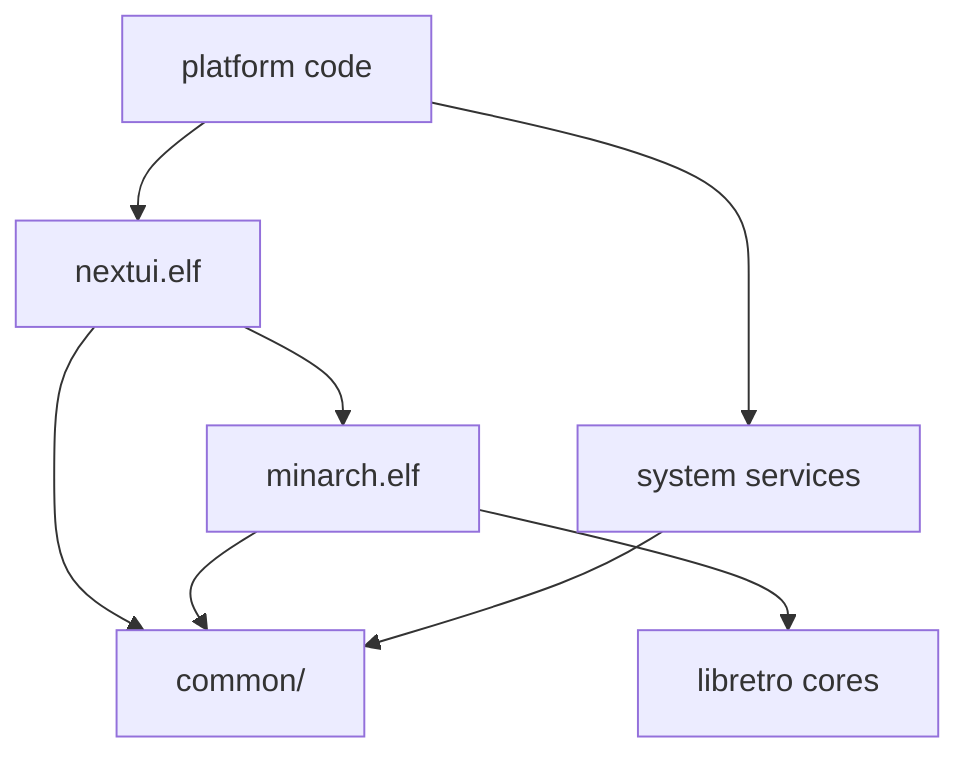

# System architecture

## Overview
系统分为四层:

1. **UI 层** — `workspace/all/nextui/nextui.c`(单文件主程序):主菜单、ROM 浏览、游戏切换器、快速菜单、设置界面,基于 SDL2 渲染。
2. **模拟器前端层** — `workspace/all/minarch/`:基于 libretro 的自研前端 `minarch.elf`(加载 `*_libretro.so` 核心),提供 Rewind、Cheats、Saves、RetroAchievements 等集成。
3. **系统服务层** — 一组小精灵:`keymon`(按键)、`audiomon`(音频)、`batmon`/`battery`(电量)、`gametime`(游戏时长)、`syncsettings`(亮度/音量同步)、`ledcontrol`(LED)、`btmanager`(蓝牙)、`poweroff`。公共代码在 `workspace/all/common/`(API、配置、HTTP、RetroAchievements、scaler、palette、SDL 封装)。
4. **平台层** — `workspace/<platform>/` 存放设备特定代码(`libmsettings`、`keymon`、`install`、`cores/patches`);`skeleton/` 提供 SD 卡目录骨架(Bios、Roms、Saves、Shaders、Overlays)。

横向的 **Paks 扩展系统** 覆盖 UI 之外:`Emus/` 与 `Tools/` 下的 `.pak` 文件夹(含 `launch.sh`)可捆绑自己的 libretro 核心或独立模拟器。SD 卡布局固定:`Roms/`、`Emus/`、`Tools/`、`.system/`、`.userdata/`(见 `PAKS.md`)。

## Module graph

## Constraints
- 仅支持 RGB565 像素格式;不实现 OpenGL libretro API
- 目标设备资源受限(内存/CPU/电池),服务与 UI 必须轻量
- SD 卡路径约定固定(`defines.h` 中集中定义:ROMS_PATH、SYSTEM_PATH、USERDATA_PATH 等)
- `.system/` 在每次更新时被整体重建,额外 Paks 必须放在 SD 卡根部的 `Emus/` / `Tools/`
- 构建为交叉编译(主机 makefile + 工具链容器);`PLATFORM=desktop` 用于本机调试
