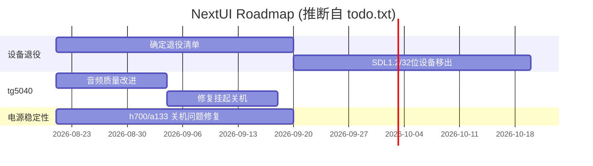

# Roadmap

## Milestones

```mermaid
gantt
  title NextUI Roadmap (推断自 todo.txt)
  dateFormat YYYY-MM-DD
  section 设备退役
  确定退役清单 :d1, 2026-08-21, 30d
  SDL1.2/32位设备移出 :after d1, 30d
  section tg5040
  音频质量改进 :a1, 2026-08-21, 14d
  修复挂起关机 :after a1, 14d
  section 电源稳定性
  h700/a133 关机问题修复 :p1, 2026-08-21, 30d
```
## Notes
- 里程碑从 `todo.txt` 推断,非官方承诺
- 当前活跃平台: tg5050、tg5040(默认 PLATFORMS);旧设备(SDL1.2/低于480p/被取代型号)计划逐步退役
- 详见 `todo.txt` 讨论(退役清单、tg5040 启动耗时、my355 固件等)
