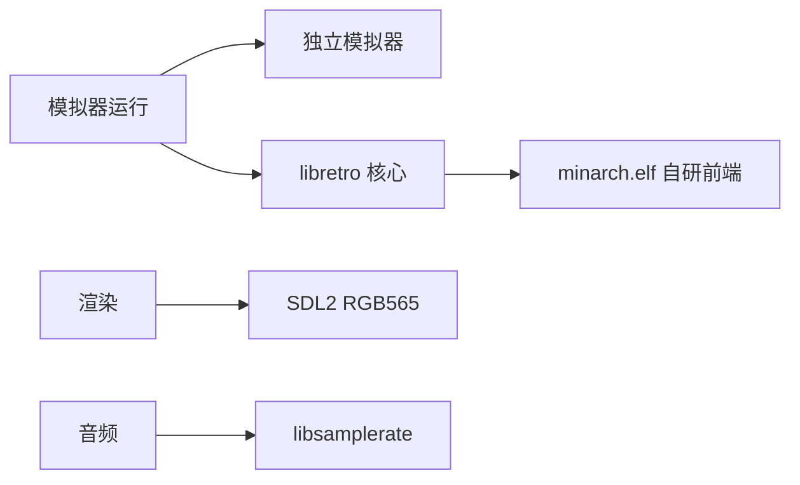

# Tech stack

## Technology choices
| domain | candidates | decision | rationale |
|---|---|---|---|
| 语言 | C / C++ | C(C99) | 资源受限嵌入式目标,依赖少、启动快、跨工具链稳定 |
| 图形/输入/音频 | SDL1.2 / SDL2 | SDL2(SDL1.2 正在退役) | 跨设备一致;渲染上下文启动快 |
| 音频重采样 | libsamplerate / 内置重采样 | libsamplerate | 高质量;可逐模拟器配置质量/性能 |
| 模拟器接口 | 独立模拟器 / libretro | libretro 核心 + 自研 minarch 前端 | 核心共用且与前端(存档/暂停/菜单)深度集成 |
| 光盘镜像 | ISO / CHD | libchdr | 支持压缩 CHD 镜像 |
| 成就系统 | RetroAchievements API | rcheevos 集成 | 与 libretro 核心无缝配合 |
| 构建 | CMake / make | make + 交叉编译工具链容器 | MinUI 遗产,直接简单 |

## Decision mindmap

## Open items
- 退役 SDL1.2 / 低分辨率 / 32 位设备的最终清单与时间点(见 `todo.txt` 讨论)
- tg5040 启动耗时优化(渲染上下文 ~500ms vs 其他设备 ~200ms,原因未定)
